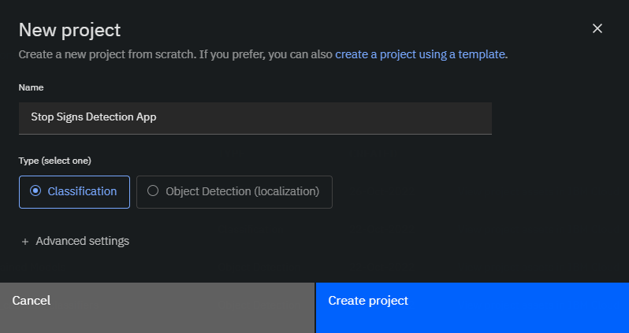
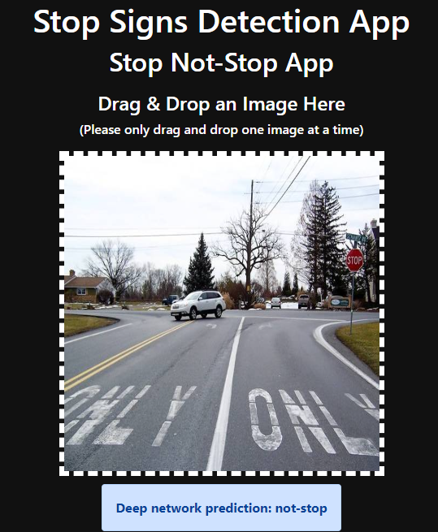
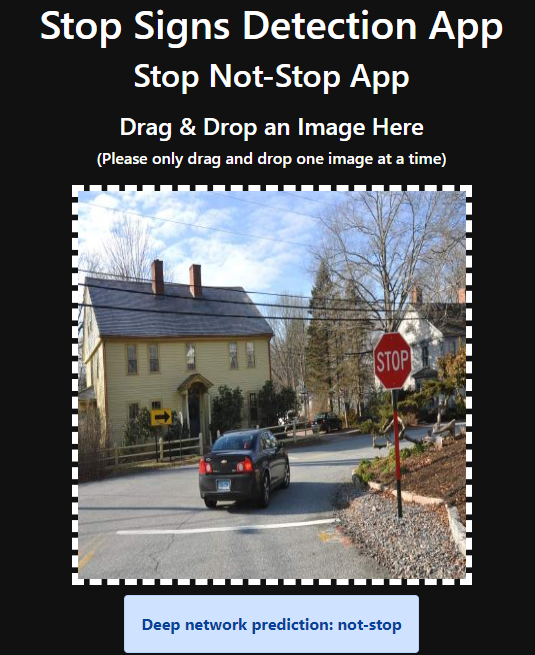
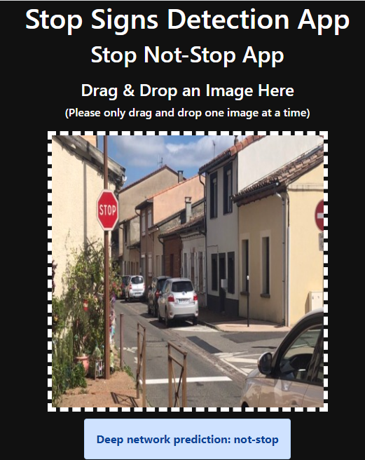
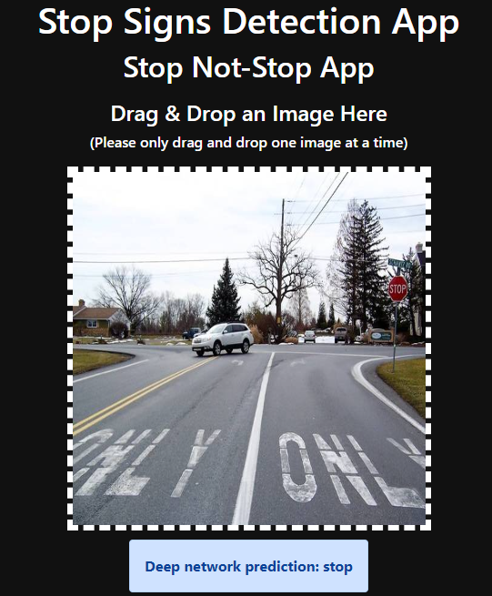

# Project Objective

Design, train, and test deep convolutional neural networks with transfer learning to perform a stop sign classification task with PyTorch and IBM Computer Vision Studio.

----------------------------------------------------------

# CV Studio

When building Computer Vision applications, we deal with a lot of images, videos, and other assets that require storage. Image processing also requires significant computing power. The ultimate goal of every computer vision project is to have it deployed as part of an application and every application requires infrastructure to run.

CV Studio is a Computer Vision learning tool for building, running, and managing AI Vision computer models and optimizing decisions anywhere on the IBM Cloud. It uses cutting-edge tools like Jupyter Notebook, Watson Machine Learning, Elyra, and more.

----------------------------------------------------------

# Project steps / pipline:

  * ## 1- Built the dataset

  After logging into CV Studio and creating a new project, I collected and uploaded 200 images divided into 100 images with stop sign and 100 images without stop sign.

  

  

  ----------------------------------------------------------

  * ## 2- Annotate the dataset

  Since I named my folders with the respective categories (stop, don't stop) when I uploaded my images in the previous upload step, the annotation happened automatically on CV Studio. 

  And here in the annotate section, I verified that my images are labeled as expected.

  

  ----------------------------------------------------------

  * ## 3- Train the model

  I chose a Jupyter notebook as a "Training tool" and used the image annotations from the previous step to train a CNN model using transfer learning (using the `ResNet` pre-trained model as a fixed feature extractor) to perform a stop sign classification task with PyTorch. 

  
   

  ----------------------------------------------------------

  * ## 4- Test the model

  To test the classifier, enter the URL of the web app below into any web browser, and enjoy testing the model:

  `
  https://stop-not-stop-app-635dc9a1b6ccf16d413f30f6.u8wpmjcrkw2.eu-gb.codeengine.appdomain.cloud/
  `

  Upload or drop & drag an image into the box and the prediction of the deep network will show at the bottom.

  

----------------------------------------------------------

# Results & Observation

I tested the app on several images, and the overall performance of the classifier seems very good.

correct stop1 prediction:

correct stop2 prediction:

correct stop3 prediction:

correct stop4 prediction:

correct not-stop1 prediction: 

correct not-stop2 prediction: 

correct not-stop3 prediction:

However, it failed to correctly classify the images below.

incorrect not-stop prediction:

 

incorrect stop1 prediction:

incorrect stop2 prediction:

incorrect stop3 prediction:

----------------------------------------------------------

# Re-train The Model

Machine learning workflow is an iterative process, and it is pretty common when developing a machine learning model to take a step/steps back and make some adjustements to improve the performance of the classifier and make it produce better predictions.

My custom deep neural network made some mistakes in classifying some of the test images due to the small number of training dataset on which I trained the model. One way to improve classifier performance is to increase the size of the training dataset.

Therefore, I gathered and uploaded more images on CV Studio. I doubled the size of the training dataset, so my new dataset contains 400 images divided into 200 images per class.

Then, I retrained the deep neural network on the updated dataset. Apparently, an increase in the number of images led to an increase in the accuracy of the custom model, as well as an increase in the total training run time. 

accuracy & training run time of 200 images:

accuracy & training run time of 400 images:

By feeding the classifier with more data, it gets to learn more information about stop and not-stop signs and understand the relationship between input and output, and as a result, it became smarter and made better predictions.  

As we can see in the images below, the deep neural network correctly classified the previously misclassified images, which indicates an improved performance.

correct not-stop4 prediction:

correct stop1 prediction:

correct stop2 prediction:

correct stop3 prediction:

