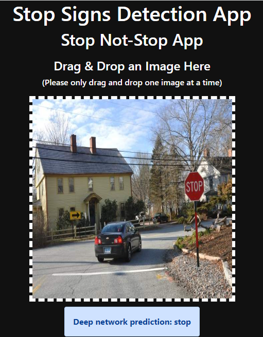
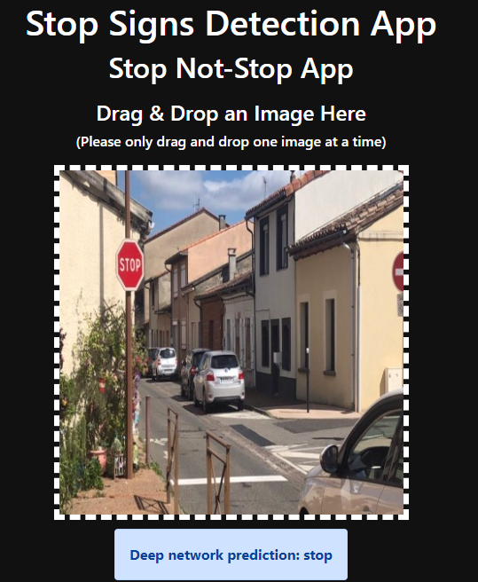

# Transfer Learning with Convolutional Neural Networks For Stop Sign Classification (Supervised Machine Learning Task) with PyTorch and Computer Vision Studio.

----------------------------------------------------------

# Objective

Design, train, and test a deep convolutional neural networks with transfer learning using Resnet pretrained model as a fixed feature extractor archtecther,and then deploy the custom model on CV Studio to make predictions on new images.

Develop a new custom classifier with PyTorch using transfer learning (a classification method that takes advantis of a pre-trained model that has train revously on a very large dataset such as ImageNet), and then deploy it as a web app using Code Engine on IBM cloud.

# CV Studio

Computer Vision Learning Studio uses IBM Cloud Object Storage to store your uploaded media and annotations, so it is required to have an IBM Cloud account. 

# Tools & Libraries

# Usge

Simply just enter the URL of the web app below into any web browser, and have fun testing the model:

`
https://stop-not-stop-app-635dc9a1b6ccf16d413f30f6.u8wpmjcrkw2.eu-gb.codeengine.appdomain.cloud/
`

# Project steps / pipline:

  * 1- Built the datast

  Initily I uploaded a 200 images on CV Studio

  * 2- Annotate the dataset

  Here I created two classes or labels: 
  stop
  not-stop
  then divided and labeled the uploaded images as a 100 images of each class

  * 3- Train the model

  Develop & train a model by creating a new training run on CV Studio.

  Used a Jubytur notbook on CV Studio to design and train a custom classifier 

  * 4- Test the model

# Results & Observation

The Overall performance of the classifier seems pretty good on the test data, the classifier was able to classify all of the stop test images correctly as well as the majority of the not-stop test images.

However, it fails to recognize the not-stop below correctly and classified as a stop one.
 

Moreover, I have tested the app with more unseen imges and catched these misclassied results by the classifier.

# Re-train The Model

Machine learning workflow is an iterative process, and it is preety common when develop a machine learning model to take a step/s back and adjust some steps in order to improve the performace of the classifier and make it produce better peridctions.

My custom deep nueral network made some mistakes peridcting the wrong class of some of the test images due to the lack of the number of the training dataset, one way to increase the performance of the classifier is to increase the size of the training dataset.

Therefore I gathured more images, uploaded and annotated them on CV Studio. I have doubled the size of the training dataset,so my new dataset has 400 images divided into 200 images for each class.

Then I retranied the deep neural network on the updated dataset. And it terns out, incraesing the number of images leads to increase the accuracy of the custom model, as well as the overall trainig run time. 

By feeding the classifier more data it get to learn more information about the stop & not-stop sings and understand the relationship between the input and the output, as a result it becoms more smarter and gave better peridctions.

As we can see in the images below, the deep neural network was able to correctly clasify the prefously misclassifief images, which indicats improved performance.

